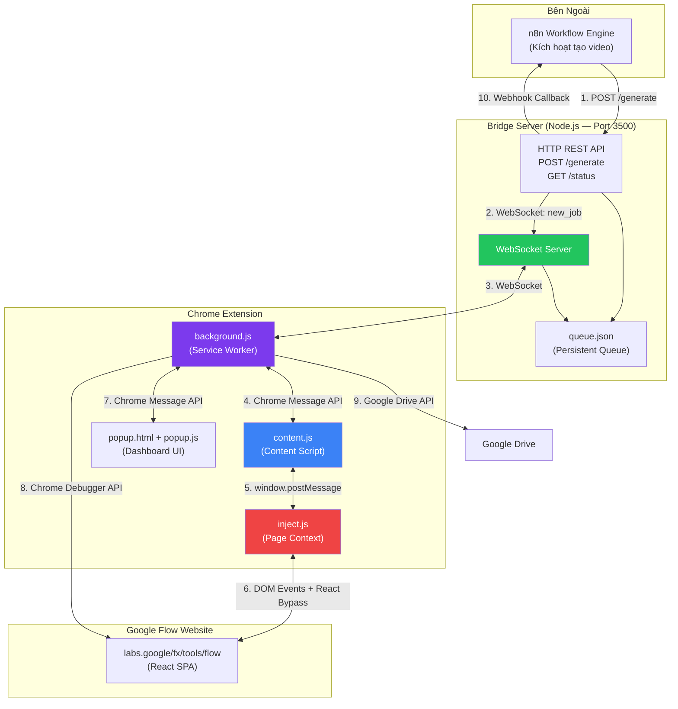
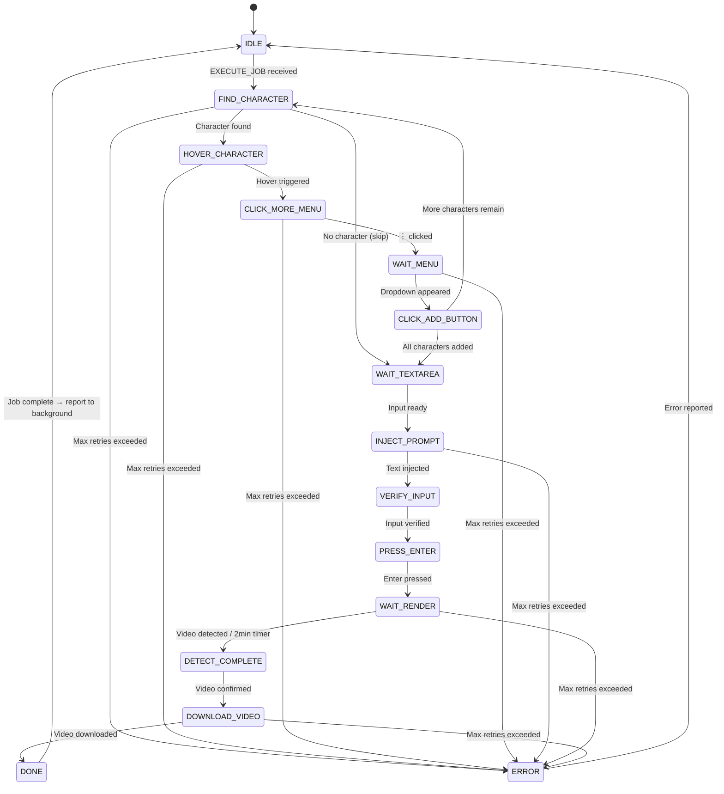

# 📖 Tài Liệu Luồng Hoạt Động & Kiến Trúc Tự Động Hóa
## Dự án: Flow Auto Generator (Chrome Extension v4.4)

> **Mục đích**: Extension tự động hóa hoàn toàn quy trình tạo video AI trên Google Flow (Video FX) — từ nhận prompt, chọn nhân vật, gửi lệnh render, đến tải video & upload Google Drive — chạy 24/7 trên VPS.

---

## 📁 Cấu Trúc Dự Án

```
flow-auto-generator/
├── manifest.json          # Chrome Extension Manifest V3
├── constants.js           # Hằng số dùng chung: states, retry, timeout, message types
├── background.js          # Service Worker: WebSocket client, job queue, tab management
├── content.js             # Content Script: state machine controller (inject vào trang Flow)
├── inject.js              # Page Context Script: DOM manipulation, React bypass, video download
├── popup.html             # Popup UI: dashboard HTML + inline CSS
├── popup.js               # Popup Logic: render dashboard, event handlers
├── FLOW_ARCHITECTURE.md   # Tài liệu này
└── bridge/
    ├── server.js           # Bridge Server: HTTP API + WebSocket server
    ├── package.json        # Dependencies: express, ws, cors
    └── queue.json          # Persistent job queue (JSON file)
```

---

## 🏗️ 1. Kiến Trúc Hệ Thống Tổng Quan

Hệ thống gồm **4 thành phần chính** phối hợp qua 4 giao thức giao tiếp khác nhau:



### 1.1 Giao Thức Giao Tiếp

| Kênh | Từ → Đến | Giao thức | Mục đích |
|:---|:---|:---|:---|
| ① | n8n → Bridge | HTTP POST | Gửi job tạo video |
| ② | Bridge → Extension | WebSocket | Dispatch job real-time |
| ③ | Extension → Bridge | WebSocket | Báo cáo trạng thái, kết quả |
| ④ | background.js ↔ content.js | Chrome Message API | Điều phối job, health check |
| ⑤ | content.js ↔ inject.js | `window.postMessage` | Gửi action DOM, nhận kết quả |
| ⑥ | inject.js → Website | DOM Events, React bypass | Thao tác trực tiếp UI |
| ⑦ | background.js ↔ popup.js | Chrome Message API | Dashboard, settings |
| ⑧ | background.js → Website | Chrome Debugger API | Gõ text, nhấn Enter (OS-level) |
| ⑨ | background.js → Google Drive | REST API + OAuth | Upload video |
| ⑩ | Bridge → n8n | HTTP POST (Webhook) | Callback kết quả |

---

## 🧩 2. Chi Tiết Từng Thành Phần

### 2.1 Bridge Server (`bridge/server.js`)

**Vai trò**: Trung gian giữa n8n workflow và Chrome Extension. Quản lý hàng đợi persistent.

**Stack**: Node.js + Express + WebSocket (`ws` library)

**API Endpoints**:

| Method | Path | Mô tả |
|:---|:---|:---|
| GET | `/` | Health check — trạng thái server + extension |
| POST | `/generate` | Nhận job mới từ n8n (prompt, character, projectId...) |
| GET | `/status` | Trạng thái chi tiết: job hiện tại, queue, history |
| GET | `/queue` | Danh sách queue đầy đủ |
| POST | `/cancel` | Hủy job (đang chạy hoặc trong queue) |
| POST | `/pause` | Tạm dừng xử lý queue |
| POST | `/resume` | Tiếp tục xử lý queue |
| POST | `/retry` | Retry job đã failed |
| POST | `/clear-history` | Xoá lịch sử + unstick queue |

**Payload `/generate`** (gửi từ n8n):
```json
{
  "projectId": "my_project",
  "sceneId": "scene_001",
  "character": "Anna, Ben",
  "prompt": "A woman walking through a futuristic city at sunset...",
  "callbackUrl": "https://n8n.example.com/webhook/video-done",
  "driveFolderId": "1ABC...",
  "rowId": "row_42"
}
```

**Quy trình nội bộ**:
1. Nhận request → tạo job object với ID unique → push vào `jobQueue` → lưu `queue.json`
2. Gọi `dispatchNext()`: kiểm tra không bị pause, không có job đang chạy, extension đã kết nối → gửi `new_job` qua WebSocket
3. Nhận `job_completed` / `job_failed` từ extension → cập nhật history → gọi `sendCallback()` tới `callbackUrl`
4. Callback retry tối đa 3 lần với delay tăng dần (2s, 4s, 6s)

**Persistence**: Toàn bộ queue + completed + failed lưu vào `queue.json` (max 100 mỗi loại)

---

### 2.2 Background Script (`background.js`)

**Vai trò**: Bộ não trung tâm của extension. Quản lý:
- Kết nối WebSocket tới Bridge Server
- Job queue nội bộ
- Tab management (tìm/mở/refresh trang Google Flow)
- Chuyển tiếp job tới content script
- Upload video lên Google Drive
- Auto-refresh tab chống rò rỉ RAM
- Keepalive alarm (chống MV3 service worker bị kill)

**State Object** (lưu trong `chrome.storage.local`):
```javascript
{
  wsConnected: false,
  currentJob: null,
  currentState: 'IDLE',
  queue: [],
  completedJobs: [],   // max 50
  failedJobs: [],      // max 50
  logs: [],            // max 500
  paused: false,
  retryCount: 0,
  settings: {
    bridgeUrl: 'https://bridge-u03a.onrender.com',
    wsUrl: 'wss://bridge-u03a.onrender.com',
    downloadPath: 'FlowVideos',
    autoRefreshMinutes: 3,
    defaultWebhookUrl: null,
    driveFolderId: null,
    driveClientId: null,
    driveClientSecret: null,
    driveRefreshToken: null,
    driveToken: null,       // Cached access token
    tokenExpiry: 0           // Token expiry timestamp
  }
}
```

**Các Chrome Alarms**:

| Alarm | Chu kỳ | Mục đích |
|:---|:---|:---|
| `flowAutoKeepalive` | 1 phút | Giữ service worker sống, kiểm tra job timeout (15 phút), reconnect WS |
| `flowAutoRefreshTab` | Tùy chỉnh (mặc định 3 phút) | Reload trang Flow để chống rò rỉ RAM, bỏ qua nếu đang chạy job |

**Quy trình dispatch job tới content script**:
```
1. processQueue() → lấy job đầu queue
2. findOrOpenFlowTab(projectId) → tìm hoặc mở tab Flow
3. healthCheckContentScript(tabId) → ping content script
4. Nếu alive → trySendToContentScript(tabId, job)
5. Nếu dead → refreshFlowTab() → inject scripts → retry 3 lần
6. Chờ content script phản hồi JOB_COMPLETE hoặc JOB_ERROR
```

**Google Drive Upload Flow**:
```
1. Job hoàn tất với video base64
2. ensureValidToken() → kiểm tra/refresh OAuth token
3. uploadToDrive(base64, filename, folderId, token)
4. Multipart upload: metadata + video blob
5. Trả về link: https://drive.google.com/file/d/{id}/view
6. Strip base64 khỏi payload trước khi gửi Bridge (tránh crash)
```

---

### 2.3 Content Script (`content.js`)

**Vai trò**: Bộ điều khiển máy trạng thái (State Machine Controller). Chạy trong ngữ cảnh content script của trang Google Flow.

**Cơ chế bảo vệ**: Re-injection guard — biến `window._flowAutoContentLoaded` ngăn tích lũy listener khi tab được refresh nhiều lần trên VPS 24/7.

**Khởi tạo**:
1. Kiểm tra re-injection guard
2. Inject `inject.js` vào page context qua thẻ `<script>`
3. Đăng ký listener `chrome.runtime.onMessage` (từ background)
4. Đăng ký listener `window.addEventListener('message')` (từ inject.js)
5. Báo cáo trạng thái IDLE về background

**State Machine Flow**:



**Cơ chế Retry & Timeout**:
- Mỗi state có **timeout riêng** (từ `STATE_TIMEOUTS` trong `constants.js`)
- Khi timeout → gọi `retryState()` → tăng `retryCount` → chờ `RETRY_DELAYS[state][retryCount]` → thực thi lại
- Khi vượt max retries → `errorJob()` → báo cáo lỗi về background → chuyển về IDLE

| State | Timeout | Max Retries | Retry Delays |
|:---|:---|:---|:---|
| FIND_CHARACTER | 30s | 5 | 1s, 2s, 5s, 10s, 10s |
| HOVER_CHARACTER | 10s | 3 | 1s, 2s, 5s |
| CLICK_MORE_MENU | 10s | 5 | 0.5s, 1s, 2s, 3s, 5s |
| WAIT_MENU | 15s | 5 | 0.5s, 1s, 2s, 3s, 5s |
| CLICK_ADD_BUTTON | 10s | 3 | 1s, 2s, 5s |
| WAIT_TEXTAREA | 15s | 5 | 0.5s, 1s, 2s, 3s, 5s |
| INJECT_PROMPT | 10s | 3 | 1s, 2s, 5s |
| VERIFY_INPUT | 10s | 3 | 0.5s, 1s, 2s |
| PRESS_ENTER | 10s | 3 | 1s, 2s, 3s |
| WAIT_RENDER | 600s (10 phút) | 5 | 5s, 10s, 30s, 60s, 120s |
| DETECT_COMPLETE | 60s | 4 | 2s, 5s, 10s, 20s |
| DOWNLOAD_VIDEO | 60s | 3 | 5s, 10s, 15s |

**Xử lý nhiều nhân vật**:
- Character string `"Anna, Ben"` → tách thành mảng `["Anna", "Ben"]`
- Sau khi `CLICK_ADD_BUTTON` cho Anna → `currentCharacterIndex++` → quay lại `FIND_CHARACTER` cho Ben
- Khi hết nhân vật → tiến tới `WAIT_TEXTAREA`

**Giao tiếp với inject.js**:
- **Gửi**: `window.postMessage({ type: 'FLOW_INJECT_ACTION', action, params })`
- **Nhận**: Lắng nghe `FLOW_INJECT_RESULT`, `FLOW_RENDER_PROGRESS`, `FLOW_VIDEO_DETECTED`, `FLOW_DOWNLOAD_COMPLETE`, `FLOW_LOG`
- **Bridge Debugger**: Chuyển tiếp `FLOW_DEBUGGER_TYPE` / `FLOW_DEBUGGER_ENTER` tới background.js (vì content script không có quyền chrome.debugger)

---

### 2.4 Inject Script (`inject.js`)

**Vai trò**: Script chạy trong **page context** (không phải content script) — có quyền truy cập đầy đủ DOM, React internals, `window.fetch`. Đây là script thực hiện mọi thao tác "bàn tay" trên UI.

**Cơ chế bảo vệ**: Re-injection guard — `window._flowAutoInjectLoaded`.

#### 2.4.1 Token Interception

Monkey-patch cả `window.fetch` và `XMLHttpRequest` để trích xuất Bearer token từ header `Authorization` của mọi request tới `googleapis.com`:

```
fetch('https://...googleapis.com/...', { headers: { Authorization: 'Bearer abc123' } })
→ authToken = 'abc123'  (lưu lại để dùng cho download/upload)
```

#### 2.4.2 CSS Injection

Inject CSS rule ép hiển thị các nút overlay ẩn (chỉ hiện khi hover):
```css
img ~ button, [class*="overlay"] button { opacity: 1 !important; visibility: visible !important; }
```
Mục đích: Đảm bảo nút ⋮ (More) luôn visible để bot có thể tìm và click.

#### 2.4.3 Event Simulation

Mô phỏng hover/click với đầy đủ chuỗi sự kiện mà React delegation cần:

**Hover**: `pointerover → pointerenter → pointermove → mouseover → mouseenter → mousemove` (+ hover children cho React delegation)

**Click**: `pointerdown → mousedown → (30-70ms delay) → pointerup → mouseup → click` (delay ngẫu nhiên mô phỏng con người)

#### 2.4.4 Text Injection — 4 Chiến Lược

Vì Google Flow dùng React + Custom Elements (Wiz/Lit), việc inject text rất phức tạp. inject.js thử **4 chiến lược tuần tự**:

| # | Chiến lược | Kỹ thuật | Khi nào dùng |
|:---|:---|:---|:---|
| 1 | **Clipboard Paste** | Tạo `DataTransfer` → fire `ClipboardEvent('paste')` + event chain đầy đủ (compositionstart/update/end, beforeinput, input, change) | Ưu tiên — hoạt động tốt với rich text editor |
| 2 | **execCommand** | `document.execCommand('insertText', false, text)` | Fallback khi paste không work |
| 3 | **React Internal** | Tìm `__reactProps$` key trên element → gọi trực tiếp `onChange`/`onInput` handler | Khi React không nhận sự kiện DOM chuẩn |
| 4 | **Direct DOM** | `appendDOMValue()` + fire event sequence | Fallback cuối cùng |

**Đặc biệt cho `<textarea>` / `<input>` (non-contenteditable)**:
```javascript
// Lấy native setter để bypass React interceptor
const nativeSetter = Object.getOwnPropertyDescriptor(HTMLTextAreaElement.prototype, 'value')?.set;
nativeSetter.call(el, newVal);
// Reset React value tracker
el._valueTracker?.setValue('');
// Fire events
el.dispatchEvent(new Event('input', { bubbles: true }));
```

**Đặc biệt cho `[contenteditable="true"]`**:
- Tìm leaf container (`<p>`, `<span>`, firstElementChild)
- Di chuyển cursor tới cuối (tránh ghi đè character chip/pill)
- Append text node trực tiếp

**Sync Custom Elements (Wiz/Lit)**:
- Duyệt ngược cây DOM từ element lên body
- Với mỗi Custom Element (tag chứa `-`) → set `.value` + fire `input`/`change`

#### 2.4.5 Tìm Phần Tử UI

**findCharacterCard(name)**:
1. Tìm `` có `alt` chứa tên → leo lên card cha
2. Tìm element có `aria-label` chứa tên
3. Tìm `[role="button/listitem"]` có `textContent` chứa tên
4. Nếu không thấy → dùng Search Bar: inject tên vào ô tìm kiếm → chờ 2.5s → tìm lại
5. Nếu vẫn không thấy → thử với từ đầu tiên (VD: "Chanh Pink" → "Chanh")

**findMoreButton(name)** — tìm nút ⋮:
1. `aria-label` chứa "Khác/More/Menu/Options" (leo 4 cấp parent)
2. `data-tooltip` / `title` chứa "Khác/More"
3. Nút icon-only (`text.length ≤ 2` + có SVG) gần góc phải-trên card
4. `elementFromPoint` probes (6 điểm quanh góc phải-trên)
5. Global search toàn trang

**findPromptInput()** — tìm ô nhập "Bạn muốn tạo gì?":
1. Placeholder match: "Bạn muốn tạo gì" / "What do you want to create"
2. `[contenteditable="true"]` gần text placeholder
3. Input gần nút "Tác nhân" / "Characters"
4. Bất kỳ input/textarea ở nửa dưới viewport

#### 2.4.6 Render Monitoring & Video Detection

**Cơ chế kép**:
1. **Chờ cố định 2 phút** (120s timeout) — luôn fire, đảm bảo state machine tiến tiếp
2. **MutationObserver** theo dõi DOM thay đổi (disabled trong v4.4 — chỉ dùng timer)

**detectVideoComplete()**:
- Quét ngược tất cả `<video>` → lọc bỏ pre-existing (đã snapshot trước khi nhấn Enter)
- Fallback: tìm `<a download>` hoặc `<button aria-label="Download/Tải">`

#### 2.4.7 Video Download (Base64 Encoding)

```
1. Tìm video mới (max 3)
2. fetch(videoUrl) → blob
3. FileReader.readAsDataURL(blob) → base64 string
4. Gửi base64 + authToken về content.js qua FLOW_DOWNLOAD_COMPLETE
5. content.js → background.js → upload Google Drive (nếu cấu hình)
6. Strip base64 trước khi gửi tới Bridge (tránh payload quá lớn)
```

---

### 2.5 Popup Dashboard (`popup.html` + `popup.js`)

**Vai trò**: Giao diện quản trị cho người dùng.

**Các section**:

| Section | Chức năng |
|:---|:---|
| Connection Bar | Hiển thị trạng thái Bridge + State hiện tại |
| Stats | 4 ô: Queue / Done / Failed / Retries |
| Current Job | Chi tiết job đang chạy + progress bar |
| Controls | Pause / Resume / Skip / Cancel |
| Auto-Refresh | Tùy chỉnh thời gian auto-refresh trang (0-60 phút) |
| Queue | Danh sách job đang chờ |
| Manual Job | Form gửi job thủ công (prompt, character, webhook, Drive folder) |
| Settings | Bridge URL, Default Webhook, Drive OAuth credentials |
| Logs | Real-time log (max 100 dòng) |

**Dashboard polling**: Mỗi 2 giây gọi `GET_DASHBOARD` tới background.js.

**Progress bar**: Tính từ vị trí state hiện tại trong `STATE_ORDER` (14 bước) → phần trăm.

---

## 🔄 3. Luồng Hoạt Động Chi Tiết (End-to-End)

### 3.1 Luồng Tổng Thể

```mermaid
sequenceDiagram
    autonumber
    participant N8N as n8n Workflow
    participant BR as Bridge Server
    participant BG as background.js
    participant CS as content.js
    participant IJ as inject.js
    participant WEB as Google Flow
    participant DRIVE as Google Drive

    Note over N8N: Workflow kích hoạt (schedule/trigger)
    N8N->>BR: POST /generate {prompt, character, projectId, callbackUrl}
    BR->>BR: Tạo job → lưu queue.json
    BR-->>N8N: {jobId, position}
    
    rect rgb(20, 20, 40)
        Note over BR,BG: WebSocket Channel
        BR->>BG: {type: "new_job", job: {...}}
        BG->>BG: enqueueJob() → processQueue()
    end
    
    BG->>BG: findOrOpenFlowTab(projectId)
    BG->>CS: healthCheckContentScript → HEALTH_CHECK
    CS-->>BG: {ok: true}
    
    rect rgb(20, 35, 25)
        Note over BG,CS: Chrome Message API
        BG->>CS: {type: "EXECUTE_JOB", job: {...}}
        CS->>CS: startJob() → parse characters
    end
    
    rect rgb(35, 20, 20)
        Note over CS,WEB: State Machine Execution (13 states)
        loop Cho mỗi character
            CS->>IJ: findCharacter
            IJ->>WEB: Tìm card nhân vật (search nếu cần)
            IJ-->>CS: ✓ Found
            
            CS->>IJ: hoverCharacter
            IJ->>WEB: Simulate pointer/mouse events
            
            CS->>IJ: clickMoreMenu
            IJ->>WEB: Simulate click nút ⋮
            
            CS->>IJ: waitMenu
            IJ->>WEB: Chờ dropdown "Thêm vào câu lệnh"
            
            CS->>IJ: clickAddButton
            IJ->>WEB: Click "Thêm vào câu lệnh"
        end
        
        CS->>IJ: waitTextarea
        IJ->>WEB: Tìm ô "Bạn muốn tạo gì?"
        
        CS->>IJ: injectPrompt
        IJ->>CS: Request DEBUGGER_TYPE
        CS->>BG: DEBUGGER_TYPE {text}
        BG->>WEB: chrome.debugger.sendCommand("Input.insertText")
        Note over IJ: Fallback: DOM injection nếu Debugger fail
        
        CS->>IJ: verifyInput
        IJ->>WEB: Đọc lại textContent/value
        
        CS->>IJ: pressEnter
        IJ->>CS: Request DEBUGGER_ENTER
        CS->>BG: DEBUGGER_ENTER
        BG->>WEB: chrome.debugger → rawKeyDown(Enter)
        IJ->>WEB: Tìm & click nút Submit (backup)
        
        Note over WEB: ⏳ AI Rendering... (≈2 phút)
        CS->>IJ: waitRender
        IJ->>IJ: setTimeout 120s
        IJ-->>CS: FLOW_VIDEO_DETECTED
        
        CS->>IJ: detectComplete
        IJ->>WEB: Quét <video> mới (loại bỏ pre-existing)
        
        CS->>IJ: downloadVideo
        IJ->>WEB: fetch(videoUrl) → blob → Base64
        IJ-->>CS: FLOW_DOWNLOAD_COMPLETE {videos[], token}
    end
    
    CS->>BG: JOB_COMPLETE {result: {videos}}
    
    rect rgb(20, 20, 40)
        BG->>DRIVE: Upload video (multipart, OAuth refresh)
        DRIVE-->>BG: {fileId, viewUrl}
        BG->>BR: {type: "job_completed", result}
        BR->>N8N: POST callbackUrl {jobId, status, result}
    end
    
    BG->>BG: processQueue() → job tiếp theo
```



### 3.2 Bảng Chi Tiết 13 Trạng Thái

| # | State | inject.js Action | Hành động cụ thể | Điều kiện chuyển tiếp |
|:---|:---|:---|:---|:---|
| 1 | `FIND_CHARACTER` | `findCharacter` | Tìm card nhân vật: quét `img[alt]`, `[aria-label]`, text content. Nếu không thấy → dùng Search Bar → nhập tên → chờ 2.5s → tìm lại. Thử cả từ đầu tiên. | Tìm thấy → `HOVER_CHARACTER`. Không có character → bỏ qua tới `WAIT_TEXTAREA`. |
| 2 | `HOVER_CHARACTER` | `hoverCharacter` | Mô phỏng `pointerover/enter/move` + `mouseover/enter/move` lên card + child element. Chờ 1s. | Hover thành công → `CLICK_MORE_MENU`. |
| 3 | `CLICK_MORE_MENU` | `clickMoreMenu` | Hover lại card (500ms) → tìm nút ⋮ (4 chiến lược) → simulate click. Chờ 600ms. | Click thành công → `WAIT_MENU`. |
| 4 | `WAIT_MENU` | `waitMenu` | `waitForCondition()` với MutationObserver: chờ button chứa text "Thêm vào câu lệnh" hoặc "Add to prompt" xuất hiện. Timeout 5s. | Menu xuất hiện → `CLICK_ADD_BUTTON`. |
| 5 | `CLICK_ADD_BUTTON` | `clickAddButton` | Tìm + click nút "Thêm vào câu lệnh". Chờ 800ms. | Click xong → nếu còn character tiếp → quay lại `FIND_CHARACTER`. Hết character → `WAIT_TEXTAREA`. |
| 6 | `WAIT_TEXTAREA` | `waitTextarea` | `waitForCondition()`: tìm ô nhập prompt (4 chiến lược). Timeout 5s. | Input sẵn sàng → `INJECT_PROMPT`. |
| 7 | `INJECT_PROMPT` | `injectPrompt` | **Ưu tiên**: Chrome Debugger API (`Input.insertText`) — gõ OS-level. **Fallback** (nếu debugger fail hoặc timeout 15s): DOM injection 4 chiến lược. Thêm space đầu để tách khỏi character chip. | Text đã vào ô → `VERIFY_INPUT`. |
| 8 | `VERIFY_INPUT` | `verifyInput` | Đọc lại `value` hoặc `textContent` của ô nhập. Kiểm tra `length > 0`. | Có nội dung → `PRESS_ENTER`. |
| 9 | `PRESS_ENTER` | `pressEnter` | Snapshot pre-existing videos. **Ưu tiên**: Debugger API (`Input.dispatchKeyEvent` rawKeyDown Enter). **Fallback**: DOM `KeyboardEvent`. **Backup**: Tìm + click nút Submit (sau 800ms). | Gửi thành công → `WAIT_RENDER`. |
| 10 | `WAIT_RENDER` | `waitRender` | Chờ cố định **120 giây** (2 phút). Kiểm tra nhanh nếu video đã có sẵn. Sau 120s tự fire `FLOW_VIDEO_DETECTED`. | Video detected / timer hết → `DETECT_COMPLETE`. |
| 11 | `DETECT_COMPLETE` | `detectComplete` | Quét tất cả `<video>` → lọc bỏ pre-existing (đã lưu trước PRESS_ENTER) → trả về danh sách video mới (max 3). Fallback: tìm `<a download>`. | Có video mới → `DOWNLOAD_VIDEO`. |
| 12 | `DOWNLOAD_VIDEO` | `downloadVideo` | Chờ 10s cho video load xong → fetch blob → convert Base64 → gửi `FLOW_DOWNLOAD_COMPLETE` về content.js. | Download xong → `DONE`. |
| 13 | `DONE` | — | `completeJob()` → gửi `JOB_COMPLETE` về background.js. Máy trạng thái reset về `IDLE`. | → `IDLE`. |

---

## 💡 4. Các Cơ Chế Kỹ Thuật Cốt Lõi

### 4.1 Chrome Debugger API — Gõ Text OS-Level

**Vấn đề**: Google Flow dùng framework phức tạp (React + Wiz/Lit Custom Elements) với nhiều lớp interceptor. DOM events đôi khi không trigger internal state update → prompt trống khi Enter.

**Giải pháp**: Dùng Chrome Debugger API — attach vào tab → gửi command OS-level:

```
inject.js → postMessage('FLOW_DEBUGGER_TYPE', {text})
  → content.js → sendMessage('DEBUGGER_TYPE', {text})
    → background.js:
        chrome.debugger.attach(tabId, "1.2")
        chrome.debugger.sendCommand("Input.insertText", {text})
        chrome.debugger.detach(tabId)
```

Cùng cơ chế cho phím Enter (`Input.dispatchKeyEvent` với `rawKeyDown` + `keyUp`, `windowsVirtualKeyCode: 13`).

**Fallback chain**: Debugger → DOM injection (4 strategies) → timeout 15s auto-fallback.

### 4.2 React State Bypass

Khi Debugger không khả dụng, inject.js phải bypass React virtual DOM:

```javascript
// 1. Lấy native setter (bypass React's synthetic event system)
const nativeSetter = Object.getOwnPropertyDescriptor(
  HTMLTextAreaElement.prototype, 'value'
)?.set;
nativeSetter.call(el, newValue);

// 2. Reset React's internal value tracker
el._valueTracker?.setValue('');

// 3. Fire complete event chain cho framework detection
compositionstart → compositionupdate → beforeinput → input → compositionend → change
```

### 4.3 Network Interception (Token Capture)

Monkey-patch `window.fetch` và `XMLHttpRequest` để bắt Bearer token:
```javascript
window.fetch = async function(...args) {
  // Intercept requests to googleapis.com
  // Extract Authorization header → save authToken
  return originalFetch.apply(this, args);
};
```
Token dùng để: download video từ blob URL (nếu cần auth), upload lên Google Drive.

### 4.4 Anti Memory Leak (VPS 24/7)

**Vấn đề**: Google Flow sử dụng WebGL/GPU rendering nặng → rò rỉ RAM khi chạy liên tục.

**Giải pháp**: Chrome Alarm `flowAutoRefreshTab` reload trang định kỳ (mặc định mỗi 3 phút):
- Nếu đang chạy job → bỏ qua lần refresh này
- Nếu IDLE → `chrome.tabs.reload()` → chờ page load + 7s SPA hydration
- Tùy chỉnh interval 0–60 phút qua popup UI (0 = tắt)

### 4.5 Service Worker Persistence (MV3)

**Vấn đề**: Manifest V3 service worker bị Chrome tự terminate sau 30s idle.

**Giải pháp**:
1. `chrome.alarms.create('flowAutoKeepalive', { periodInMinutes: 1 })` — alarm mỗi 1 phút giữ worker sống
2. WebSocket heartbeat mỗi 25s (`WS_HEARTBEAT_INTERVAL`)
3. State persistence qua `chrome.storage.local` (debounced 2s, immediate cho critical changes)
4. Auto-reconnect WebSocket khi bị ngắt (delay tăng dần: 1s, 2s, 5s, 10s, 30s)

### 4.6 Re-injection Guard

**Vấn đề**: Khi tab được refresh hoặc scripts bị inject lại, listener tích lũy gây duplicate actions.

**Giải pháp**:
```javascript
// content.js
if (window._flowAutoContentLoaded) return;
window._flowAutoContentLoaded = true;

// inject.js
if (window._flowAutoInjectLoaded) return;
window._flowAutoInjectLoaded = true;
```

### 4.7 Global Job Timeout

Nếu một job chạy quá **15 phút** (kiểm tra bởi keepalive alarm) → force-fail:
```
❌ Global timeout: Job scene_001 running for 16 min. Force-failing...
```

---

## 📡 5. Message Types Reference

### 5.1 Chrome Message API (background ↔ content ↔ popup)

| Type | Hướng | Payload | Mô tả |
|:---|:---|:---|:---|
| `EXECUTE_JOB` | BG → CS | `{job}` | Bắt đầu xử lý job |
| `STOP_JOB` | BG → CS | — | Dừng job hiện tại |
| `HEALTH_CHECK` | BG → CS | — | Ping kiểm tra content script sống |
| `STATE_UPDATE` | CS → BG | `{state, retryCount, log}` | Báo cáo state thay đổi |
| `JOB_COMPLETE` | CS → BG | `{jobId, result}` | Job hoàn tất |
| `JOB_ERROR` | CS → BG | `{jobId, error}` | Job lỗi |
| `LOG` | CS → BG | `{message}` | Forward log từ inject.js |
| `DEBUGGER_TYPE` | CS → BG | `{text}` | Yêu cầu gõ text qua Debugger API |
| `DEBUGGER_ENTER` | CS → BG | — | Yêu cầu nhấn Enter qua Debugger API |
| `GET_DASHBOARD` | Popup → BG | — | Lấy trạng thái dashboard |
| `PAUSE_QUEUE` | Popup → BG | — | Tạm dừng queue |
| `RESUME_QUEUE` | Popup → BG | — | Tiếp tục queue |
| `CANCEL_JOB` | Popup → BG | — | Hủy job hiện tại |
| `SKIP_JOB` | Popup → BG | — | Bỏ qua job hiện tại |
| `CLEAR_LOGS` | Popup → BG | — | Xoá log |
| `CLEAR_HISTORY` | Popup → BG | — | Xoá lịch sử Done/Failed |
| `RETRY_JOB` | Popup → BG | `{jobId}` | Retry job failed |
| `MANUAL_JOB` | Popup → BG | `{prompt, character, ...}` | Gửi job thủ công |
| `UPDATE_SETTINGS` | Popup → BG | `{settings}` | Cập nhật cài đặt |
| `UPDATE_AUTO_REFRESH` | Popup → BG | `{minutes}` | Đổi thời gian auto-refresh |

### 5.2 window.postMessage (content ↔ inject)

| Type | Hướng | Payload |
|:---|:---|:---|
| `FLOW_INJECT_ACTION` | CS → IJ | `{action, params}` |
| `FLOW_INJECT_RESULT` | IJ → CS | `{action, success, data, error}` |
| `FLOW_RENDER_PROGRESS` | IJ → CS | `{progress}` |
| `FLOW_VIDEO_DETECTED` | IJ → CS | `{video}` |
| `FLOW_DOWNLOAD_COMPLETE` | IJ → CS | `{videos[], token}` |
| `FLOW_LOG` | IJ → CS | `{message}` |
| `FLOW_DEBUGGER_TYPE` | IJ → CS | `{text}` |
| `FLOW_DEBUGGER_RESULT` | CS → IJ | `{success, error}` |
| `FLOW_DEBUGGER_ENTER` | IJ → CS | — |
| `FLOW_DEBUGGER_ENTER_RESULT` | CS → IJ | `{success, error}` |

### 5.3 WebSocket (background ↔ bridge)

| Type | Hướng | Payload |
|:---|:---|:---|
| `register` | BG → BR | `{client: 'extension'}` |
| `ping` / `pong` | BG ↔ BR | — |
| `new_job` | BR → BG | `{job}` |
| `cancel_job` | BR → BG | `{jobId}` |
| `pause` / `resume` | BR → BG | — |
| `job_queued` | BG → BR | `{jobId}` |
| `job_started` | BG → BR | `{jobId}` |
| `state_update` | BG → BR | `{jobId, state, retryCount}` |
| `job_completed` | BG → BR | `{jobId, rowId, projectId, sceneId, result, callbackUrl}` |
| `job_failed` | BG → BR | `{jobId, rowId, projectId, sceneId, error, callbackUrl}` |

---

## 🔧 6. Cấu Hình & Vận Hành

### 6.1 Permissions (manifest.json)

| Permission | Lý do |
|:---|:---|
| `storage` | Lưu state, settings |
| `downloads` | Download video |
| `tabs` | Quản lý tab Flow |
| `activeTab` | Truy cập tab hiện tại |
| `alarms` | Keepalive + auto-refresh |
| `scripting` | Inject content scripts |
| `debugger` | Chrome Debugger API (gõ text OS-level) |

**Host permissions**: `https://labs.google/*`, `http://localhost:3500/*`

### 6.2 Cài Đặt Bridge Server

```bash
cd bridge/
npm install        # express, ws, cors
npm start          # hoặc: node server.js (port 3500)
```

### 6.3 Cài Đặt Extension

1. Mở `chrome://extensions/` → bật Developer mode
2. "Load unpacked" → chọn thư mục `flow-auto-generator/`
3. Mở popup → cài đặt Bridge URL, Webhook URL, Drive credentials
4. Mở tab `https://labs.google/fx/vi/tools/flow`
5. Extension tự động kết nối Bridge và sẵn sàng nhận job

### 6.4 Gửi Job từ n8n

```bash
curl -X POST http://localhost:3500/generate \
  -H "Content-Type: application/json" \
  -d '{
    "projectId": "my_project",
    "sceneId": "scene_001",
    "character": "Anna",
    "prompt": "A cinematic shot of a woman walking through rain...",
    "callbackUrl": "https://n8n.example.com/webhook/done"
  }'
```

---

## 📊 7. Giới Hạn & Lưu Ý

| Hạn chế | Chi tiết |
|:---|:---|
| Chrome Alarms minimum | `periodInMinutes` tối thiểu 1 phút (Chrome policy) |
| Debugger API | Chỉ 1 debugger client/tab. Nếu DevTools đang mở → Debugger sẽ fail → fallback DOM injection |
| Base64 video size | Video lớn (>100MB) có thể gây OOM khi convert Base64. Nên giới hạn < 50MB |
| Service Worker lifecycle | MV3 worker có thể bị kill bất kỳ lúc nào → state phải persistent |
| Google Flow UI changes | Selector CSS / aria-label có thể thay đổi khi Google update → cần cập nhật inject.js |
| Auto-refresh vs running job | Auto-refresh bỏ qua khi đang chạy job, nhưng job dài (>3 phút) sẽ delay refresh |
